# Hand in Hand — How to use it

Hand in Hand is a free app for parents, teachers and specialists who support children with special needs.
It keeps everything about a child in one place: profile, goals and progress, behavior, a daily home–school notebook, visual schedules, checklists and printable reports.

**Your data never leaves your computer.** It is locked with your password. There is no account, no subscription and no advertising.

---

## 1. Install

1. Download **`Hand in Hand_x.x.x_x64-setup.exe`** (from the project's GitHub *Releases* page).
2. Double-click it. Windows may show *"Windows protected your PC"* because the app is new and not yet code-signed. Click **More info → Run anyway**.
3. Follow the installer. No administrator rights are needed. The app appears in the Start menu.

Needs Windows 10 or 11. The installer adds Microsoft's WebView2 component automatically if it's missing.

---

## 2. First start: create your private space

1. Type your name and choose **Parent / carer**, **Teacher / aide** or **Therapist / specialist**.
2. Pick your **country**. It sets the spelling (behavior / behaviour), the date format and the plan types (IEP, 504, EHCP, NDIS…).
3. Create a **password** (at least 8 characters) and type it again.

### Save your recovery key

The app then shows a **recovery key**. It is the *only* way back in if you forget your password; nobody else can reset it for you.
**Print it or write it down** and keep it somewhere safe, then tick *"I have saved my recovery key"*.

---

## 3. The Today screen

- **Working with** (top left) chooses which child you are working on. Every section follows this choice.
- The four big buttons are shortcuts to the things you do most.
- The cards show active goals, behaviors this week compared with last week, and goals that haven't had any data for 2 weeks.
- The latest message from home or school appears at the bottom.

---

## 4. Children: profile and "All About Me" page

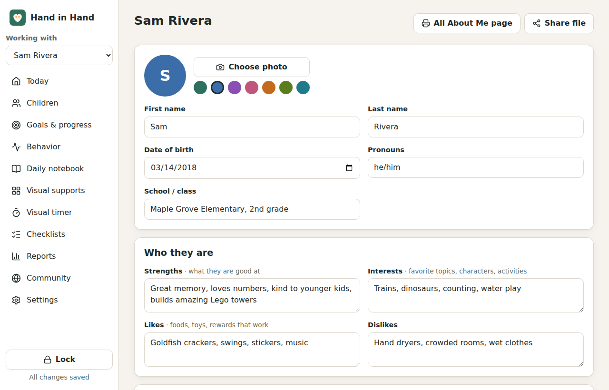

Go to **Children → Add a child**. Only the first name is required; fill the rest when you can:
strengths, interests, how the child communicates, sensory needs, triggers, what calms them, health, allergies, medications and emergency contacts.
Add a photo with **Choose photo**.

Click **All About Me page** to get a one-page summary for a new teacher, a babysitter, a substitute, or the hospital:

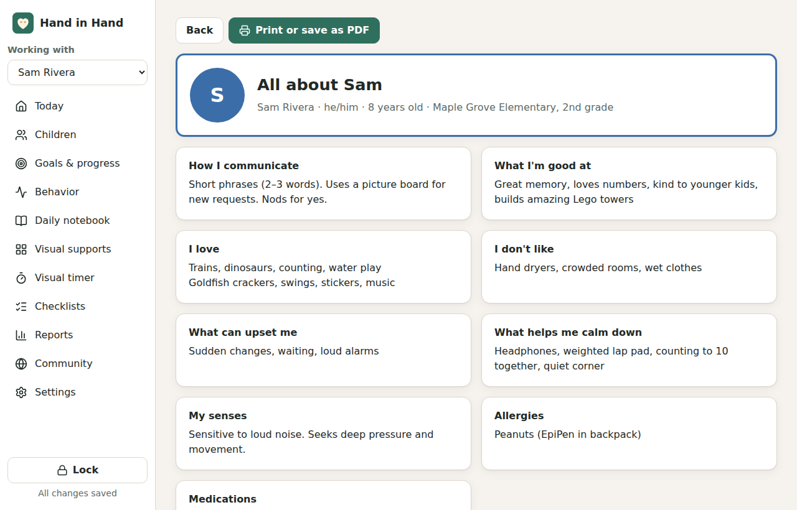

Click **Print or save as PDF**. To make a PDF, choose *Microsoft Print to PDF* as the printer.

---

## 5. Goals and progress

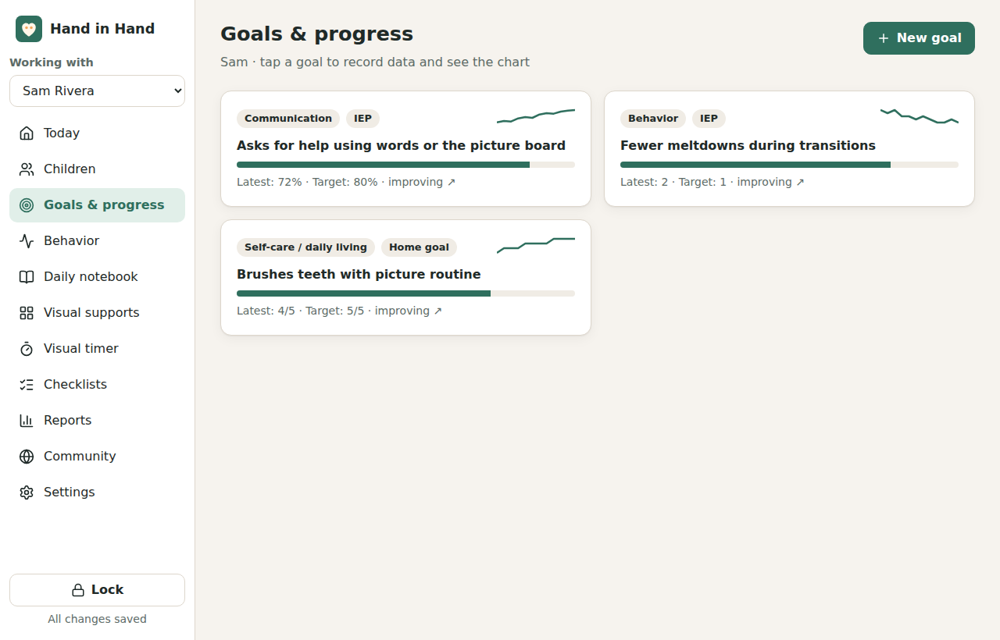

**New goal** asks for:
- **Goal**: what the child will do, e.g. *"Asks for help using words or the picture board"*.
- **Area** and **Plan** (IEP, 504, EHCP, NDIS plan, home goal…).
- **How you'll measure it**:
  - **% correct**: count correct and incorrect tries.
  - **Count**: how many times something happened. Tick *Lower is better* for things like meltdowns.
  - **Minutes**: how long something lasted, with a built-in stopwatch.
  - **Rating 1–5**: your judgement.
- **Starting point** and **Target**.

Click a goal to record a session:

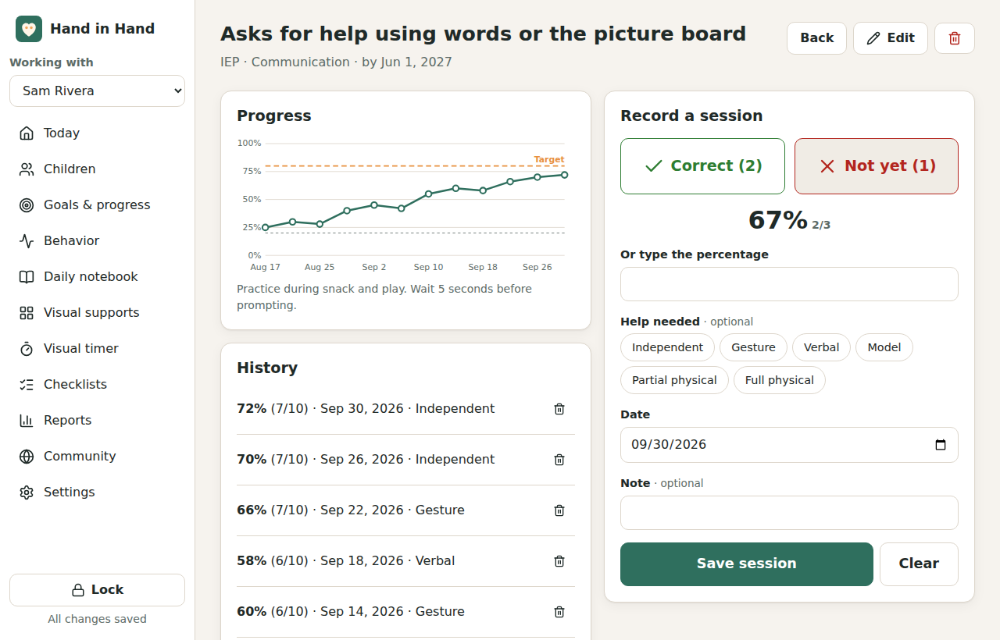

- Tap **Correct** or **Not yet** for each try; the percentage is calculated for you.
- Optionally choose **Help needed** (independent → full physical help) and add a note.
- Click **Save session**. The chart updates, with the orange dashed line showing the target.

The goal list shows a mini chart, progress toward the target, and whether the child is *improving*, *steady* or *slipping*.

---

## 6. Behavior log and patterns

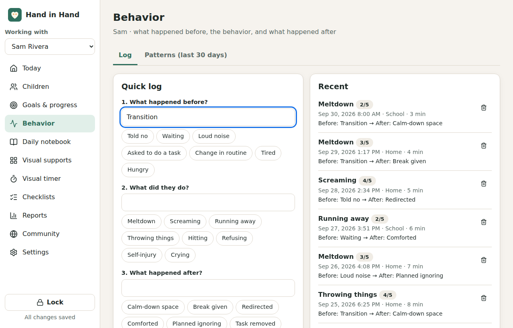

Log a behavior in a few taps:
1. **What happened before?**
2. **What did they do?**
3. **What happened after?**

Tap a suggestion or type your own; the app remembers what you use. Add how strong it was, where, when and for how long.

Open **Patterns (last 30 days)** to see what stands out:

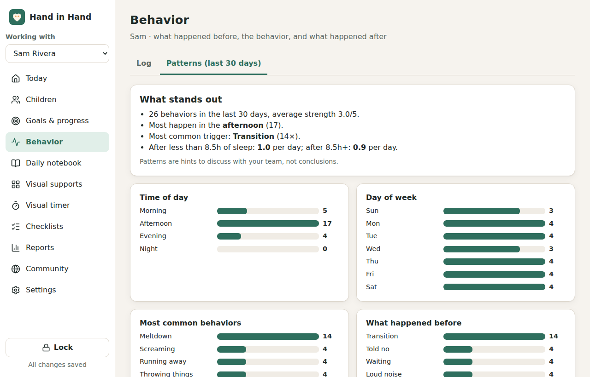

It shows the busiest time of day, the most common triggers, the days of the week and the places. If you record sleep in the daily notebook, it also compares behaviors after shorter and longer nights.
*Patterns are hints to discuss with your team, not conclusions.*

---

## 7. Daily notebook (home–school diary)

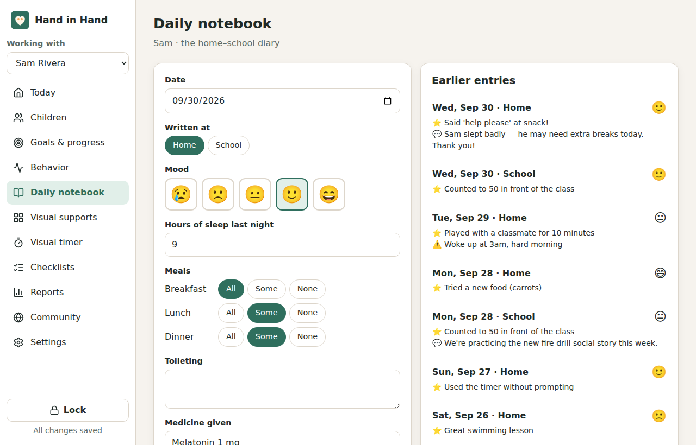

One entry per day for **Home** and one for **School**: mood, sleep, meals, toileting, medicine, what you did, good moments, concerns, and a **message** for the other side.
Click an earlier entry on the right to open it again.

To exchange the notebook with school, use a **share file** (see section 11).

---

## 8. Visual supports

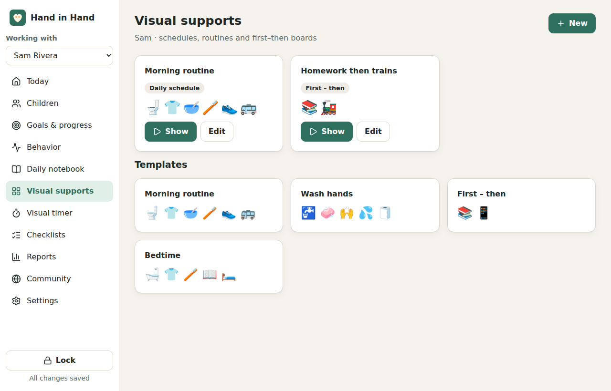

- Start from a **template** (morning routine, washing hands, first–then, bedtime) or click **New**.
- Three types: **Daily schedule**, **Step-by-step routine**, **First – then**.
- In the editor, click the picture to choose an icon or **use a photo from this computer** (photos of the real place or object often work best). Add minutes to a step to show a countdown.

Click **Show** to open full-screen mode for the child:

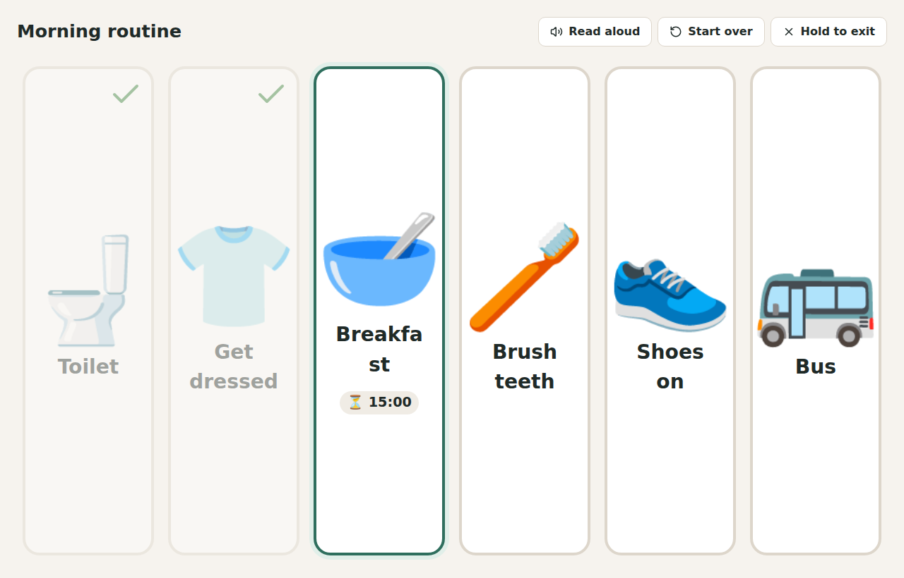

- The child taps a card when a step is done. It gets a tick, the next step is highlighted, and the label is read aloud.
- A sound plays when everything is done.
- To leave, **press and hold "Hold to exit"** for 1.5 seconds (so it doesn't close by accident), or press Esc on the keyboard.

### Visual timer

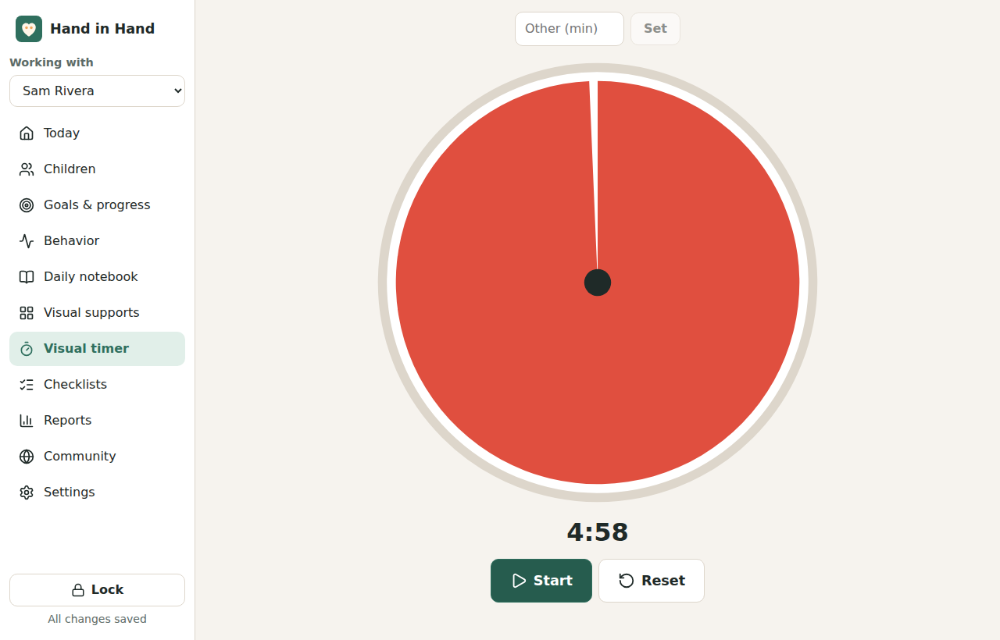

Choose the minutes and press **Start**. The red part shrinks as time passes and a sound plays at the end.

---

## 9. Checklists

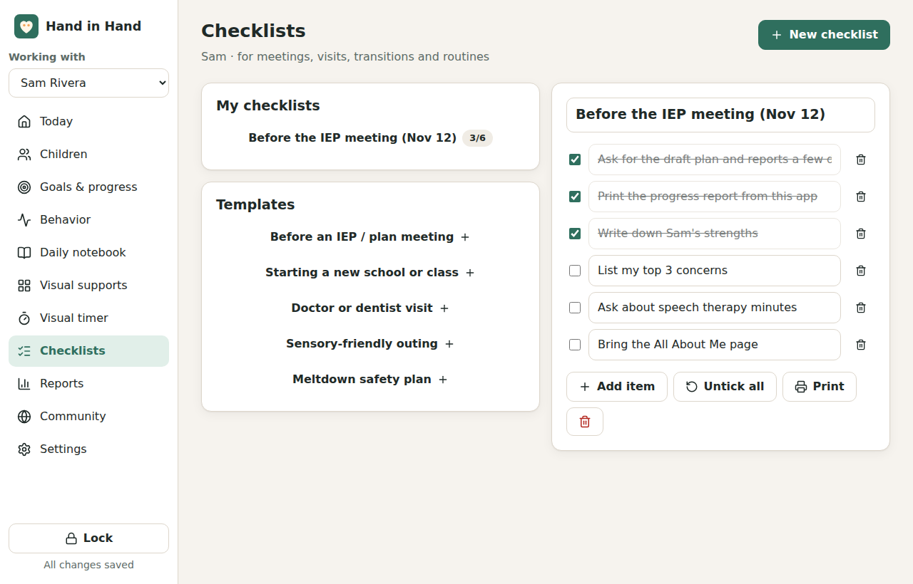

Ready-made checklists for **IEP/plan meetings**, **starting a new school**, **doctor or dentist visits**, **sensory-friendly outings** and a **meltdown safety plan**. You can also make your own.
Edit any item, tick items off, **Untick all** to reuse a list, and **Print** it.

---

## 10. Progress report for meetings

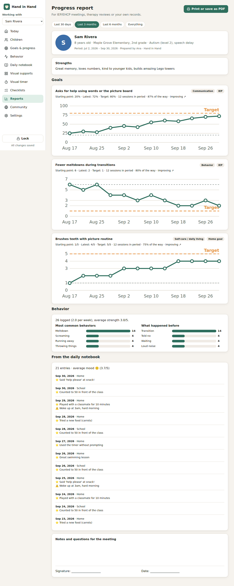

**Reports** builds a report for the chosen period (30 days, 3 months, 6 months, or everything), with:
- the child's strengths,
- every goal with its starting point, latest result, target, number of sessions, trend and chart,
- a behavior summary,
- highlights and concerns from the notebook,
- space for meeting notes and a signature.

Click **Print or save as PDF**.

---

## 11. Settings, backup and sharing

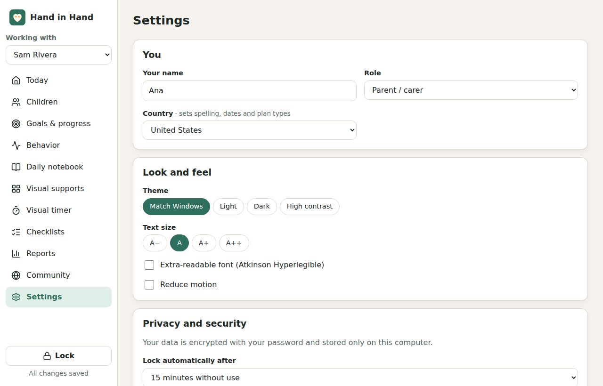

- **Look and feel**: light, dark or high-contrast theme; bigger text; an extra-readable font; reduced motion.
- **Lock automatically** after some minutes without use (15 by default).
- **Change password** or make a **new recovery key**.

### Backups
- The app saves a backup copy automatically **every day** and keeps the last 10.
- Use **Save a backup** from time to time to put a copy on a USB stick or in your own OneDrive/Google Drive folder. The backup is encrypted with your password.
- **Restore a backup** replaces everything with that backup (you'll need the password used when it was made).

### Sharing between home and school (no internet needed)
1. On the child's profile page, click **Share file** and choose a **share password**.
2. Send the `.hihshare` file by email or USB. Tell the other person the share password **separately** (in person or by phone).
3. They open **Settings → Import a share file** and enter the share password.

New information is added. If both people changed the same record, the most recent change is kept.

---

## 12. Locking

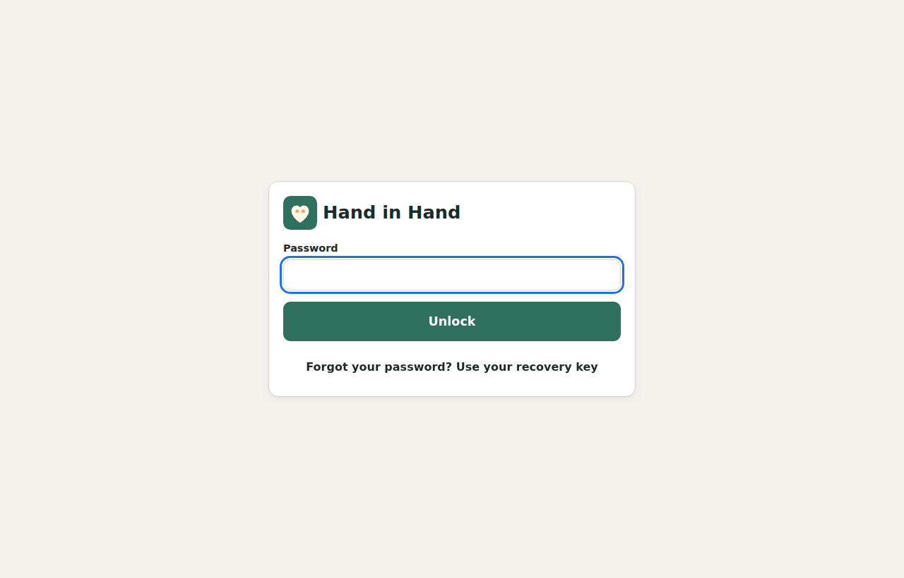

Click **Lock** (bottom left) when you step away. The app also locks itself after the time you chose.
Forgot your password? Click **"Forgot your password? Use your recovery key"**, enter the key, then choose a new password.

---

## 13. Community (coming soon)

A free online space where families, teachers and verified volunteer specialists can help each other, with points and certificates for volunteers.
It will be separate from your private records: nothing about your child is uploaded unless you post it yourself.

---

## Questions

- **Is it really free?** Yes, all of it. If you want to help, use **Support this project** in the app.
- **Is it a medical device?** No. It helps you organise information to share with professionals.
- **Can two computers use the same data?** Yes, through share files (section 11). Automatic sync may come later.
